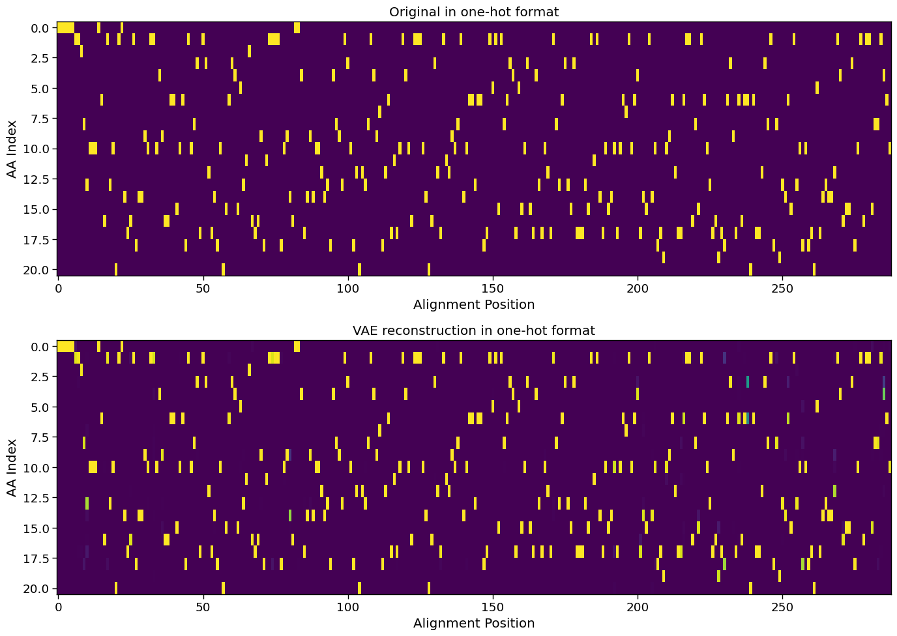
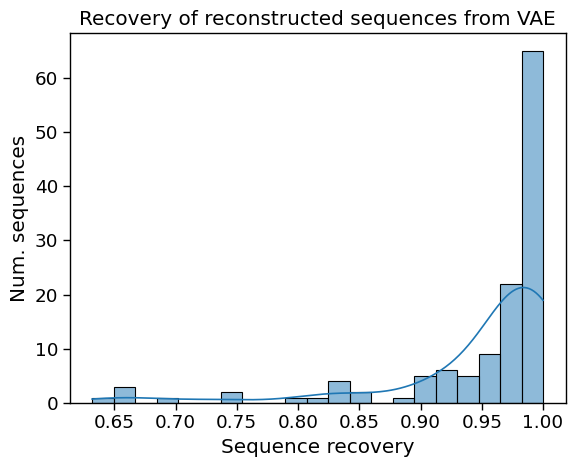

# Protein Design VAE
## Generative, Unsupervised Latent Variable Model for Protein Sequences - Variational Autoencoder (VAE)

This repository hosts the implementation of a Variational Autoencoder (VAE) specifically designed for generating protein sequences. This generative, unsupervised model leverages multiple sequence alignments to learn the complex patterns inherent in protein structures.

### Notebooks Overview

| Notebook | Description | Keywords |
|----------|-------------|----------|
| [Building Multiple Sequence Alignment for Generative Modeling](https://github.com/arjan-hada/protein-design-vae/blob/main/00_msa_for_modelling_2.ipynb) | This notebook outlines the process of constructing high-quality MSAs using BLAST High Scoring Pairs (HSPs), focusing on retaining informative alignments and excluding less relevant ones. | Multiple Sequence Alignments (MSAs), High Scoring Pairs (HSPs), BLAST, MSA Visualization, MSA Quality Control |
| [Generative Unsupervised Latent Variable Model for Protein Sequences: Variational Autoencoders](https://github.com/arjan-hada/protein-design-vae/blob/main/protein_design_vae_dev.ipynb) | Development of a convolutional VAE aimed at achieving high sequence recovery, implementing advanced training techniques like Learning Rate Finder and 1cycle Training Policy. | Convolutional VAE, Kaiming Initialization, KL Divergence, Reconstruction Loss, Learning Rate Finder, 1cycle Training Policy, fastai |

### Key Takeaways

🔹 **High-Quality MSAs**: We develop a robust methodology for constructing high-quality multiple sequence alignments using BLAST High Scoring Pairs (HSPs). This approach focuses on retaining informative alignments from HSPs while excluding those aligning with query sequence gaps.
  
🔹 **Advanced VAE Model**: The convolutional VAE implemented here achieves approximately 95% average sequence recovery. The VAE consists of an **encoder** that maps protein sequences to a latent space and a **decoder** that reconstructs sequences from the latent representations. The training objective is to minimize reconstruction loss and force the VAE to learn a distribution that is close to a standard normal distribution.
  
🔹 **Optimized Training**: Utilization of a [learning rate finder](https://arxiv.org/abs/1708.07120) and the implementation of a [1cycle training policy](https://arxiv.org/abs/1506.01186), as proposed by Leslie Smith and facilitated by the fastai library.

